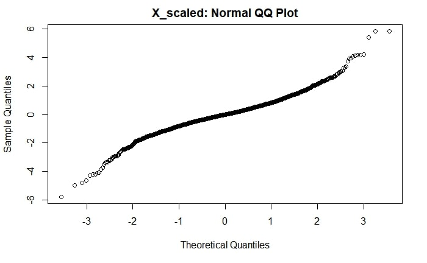

# STAT 350 Final Project: Linear Regression Analysis on U.S. Death Rate
Authors: Leo Chen & Tianxing Yan

## Abstract 
Our main purpose is to conduct a thorough regression analysis to analyze if there exist a linear relationship between U.S. death rate and a variety of independent variables. A special observation (crazytown) is also added to see if it will have any impact on feature selection and if we can detect it during model validation. At the end of all our analysis, we conclude that:
- Crazytown is identifiable during model validity analysis
- crazytown does impact feature selection, but only for manual stepwise regression
- our final linear regression model satisfies all assumption requirements
- within our variables, the most explanatory for U.S. death rate are unemployment rate, poverty level, per capital income, and number of social security beneficiaries per 1000 residents. 

## Introduction
Death has many contributing factors. In this report, we attempt to analyze U.S. death rate through linear regression analysis using U.S. 2000 census data. We also introduce a special observation (crazytown) into the dataset for special analysis purpose. Throughout this report, we are trying to answer the following five questions:
- is there a linear relationship between the death rate and some of the independent variables? If so, which variables provide the most explanatory power?
- does our linear regression model satisfy all model assumptions?
- is Crazytown identifiable during model validation?
- does crazydown affect feature selection?

The core structure of our analysis is listed below:
1) download and preprocess data, create separate copy and include crazytown
2) feature selection (manual stepwise regression & stepAIC function) for original dataset and new dataset
3) model validation for both models (original and new dataset)
4) cross validation

## Data Description
All our data originates from the U.S. 2000 census. Since the entire census dataset contains too much information, we hand picked 10 variables to regress against the death rate. The detailed description of each variable is presented below:

The additional data point we introduce is called "Crazytown". There are two goals for introducing this additional datapoint.
1) Can our model validation process identify this new datapoint?
2) Does this new datapoint change our feature selection?

All values of Crazytown are column averages except for death_rate. where the county average is about 10, and we chose Crazytown's death_rate to be 25. All values for Crazytown are shown below:

| | Country average | Crazytown |
| --- | --- | --- |
| death_rate | 10.16246 | 25.00000 |
| population | 99779.15 | 100000.00	|
| num_care_facilities | 11.77083 | 12.00000 |
| per_below_poverty | 14.85669 | 14.86000 |
| per_high_grad | 56.14779 | 56.14779 |
| per_bacherlor_grad | 13.78063 | 13.78000 |
| num_violent_crimes | 501.274 | 501.000 |
| num_property_crimes | 3516.331  | 3516.000	|
| unemploy_rate | 4.731813 | 4.730000 |
| per_cap_income_as_per_national_average | 78.73543 | 78.00000 |
| num_social_security_ben_per_1000_resid | 193.2333 | 193.0000 |

## Data Preprocessing
1) We extract all our variables from appropriate U.S. 2000 cencus data tables into a dataframe (original dataset)
2) Create another copy of the dataframe and incldue Crazytown (new dataset)
3) Unit normal scaling for all appropriate variables 

The resulting output from data preprocessing are two dataframes called "X_scaled" and "X_new_scaled". The only difference between the two is that X_new_scaled contains Crazytown.

## Feature Selection
We performed manual stepwise regression and stepAIC on both X_scaled and X_new_scaled. For our manual stepwise regression process, we set alpha = 0.05. The resulting models for each is presented below:

Interestingly, when we used stepAIC for both datasets, we get the same model, but when we implement stepwise regression, the model under X_new_scaled does not contain the "per_cap_income_as_per_national_average" variable since it does not meet the alpha = 0.05 threshold. We chose to use variables from the manual stepwise regressions in our final models for further analysis. So our final model are below:

## Model validation
At this stage, we are trying to assess if our model under X_scaled data satisfy the following assumptions:
1. The relationship between the response y and the regressors is linear, at least approximately
2. The error term ε has zero mean
3. The error term ε has constant variance
4. The errors are uncorrelated
5. The errors are normally distributed

To assess the first three assumptions, we plotted student residuals against y_hat and also against all regressors in the model.

Looking at the student residuals vs Y_hat graph, we can see the error terms are spread quite evenly around zero. Although there are some errors outside three standard deviations, we have to keep in mind that there are over 2650 observations in total, and the general shape of the graph indicate the model satisfies the first, second, and third assumption. 

We graph residual errors against each regressor below to further analyze the second and third assumptions.

Looking at these four graphs, they match our initial assessment that our model satisfies the second and third assumption. In each graph we can observe errors are spread quite evenly around zero. Once again, there are a few points that are outside three standard deviations, we think this is acceptable due to the large number of observations we have in our dataset. 

Next, we plot the QQ norm plot below:

We observe that it is not perfectly diagonal, but relatively close. We conclude that it is satisfactory to meet the 5th assumption. 

Next, we plot student residuals aginast index below:

Similar to other plots above, we observe the vast majority of errors are spread evenly in a tight band around zero. A few error terms do lie outside three standard deviations. From this graph, we conclude that this model also meets the fourth assumption.

Lastly, we calculated Cook's distance for each datapoint. If any datapoint has a value larger than 1, we deem it influential. We find that the largest Cook's distance value is only 0.04. 

At this point, we can conclude that the linear regression model using X_scaled data meets all five model assumptions. Can we identify Crazytown during model validation analysis? To answer this question, we conduct model validation analysis for the model under X_new_scaled dataset since it includes Crazytown.

Again, we plot student residuals against Y_hat, and against each regressor in the model. These graphs are presented below:

From each of these plots, we can clearly identify there is one error that is 10 standard deviations away. This point belongs to Crazytown. To make the comparison more clearly, we plot Student residuals vs Y_hat for both X_scaled and X_new_scaled data below, and we observe the only difference is the error term that belongs to Crazytown:

Lastly, we conduct cross validation analysis for two purposes:
1) Study the stability of model coefficients
2) Study the stability of prediction performance of the model

We split X_scaled dataset into 80% training and 20% validation sets. Then we run 1000 simulations and recorded each run's RMSPE, MAPE, and model coefficients. Next we plot the histogram for Root Mean Square Percentage Error (RMSPE), Mean Absolute Percentage Error (MAPE) to visualize the variability of each.

From the above graphs, we can conclude that the variablity for both RMSPE and MAPE are quite small.

Next, we also plot the histogram for model coefficients, and observe that all four coefficients' variability are minimal.

# Conclusion
At the beginning of our report, we identified five key questions to address:
  - is there a linear relationship between the death rate and some of the independent variables? 
  - If so, which variables provide the most explanatory power?
  - does our linear regression model satisfy all model assumptions?
  - is Crazytown identifiable during model validation?
  - does crazydown affect feature selection?
  
Though our analysis presented above, we conclude that:
  - There is a reasonable linear relationship between death rate and some of the independent variables; Unemploy_rate, per_below_poverty, per_cap_income_as_per_national_average, and num_social_security_ben_per_1000_resid provided the most explanatory power. R2 is 72%, so our model probably still miss some key variables that weren't included in our original set of independent variables.
  - Our linear regression model satisfies all five model assumptions
  - Crazytown was identified during model validation analysis
  - Crazytown did affect feature selection, but interestingly enough it only affected manual stepwise regression and not stepAIC 
  
What we learned:
  - Extreme outliers can affect feature selection.
  - If we do find outliers that we need to delete from our dataset, we should go back to feature selection to see if there is any change in features selected. 
  - Understanding what questions we are trying to answer is very important. It took us a while to figure out what exactly we are trying to analyze. 
  - Data preprocessing and organization is also very important. There are many components for this report and it was a lot easier to pull everything together when files and codes are organized logically.
  
# Appendix
All our raw data can be found at: [website](https://webapp1.dlib.indiana.edu/virtual_disk_library/index.cgi/4191241/FID1524)
- [death rate](Source%20data/cc00_tab_B4_vital_statistics_and_health.csv)
- [num_social_security_ben_per_1000_resid](Source%20data/cc00_tab_B13_govt_programs_employment_finances.csv)
- [population](Source%20data/cc00_tab_B1_area_population.csv)
- [per_below_poverty | per_high_grad | per_bacherlor_grad](Source%20data/cc00_tab_B5_education_income_poverty.csv)
- [num_violent_crimes](Source%20data/cc00_tab_B6_crime_housing_building_permit.csv)
- [unemploy_rate](Source%20data/cc00_tab_B7_labor_force_employment.csv)
- [per_cap_income_as_per_national_average](Source%20data/cc00_tab_B8_personal_income_earnings.csv)

All our code can be found at: [RMD file](STAT%20350%20Final%20Project%20-%20Yan%20&%20Leo.Rmd). 

