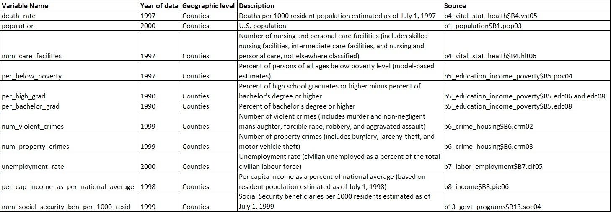
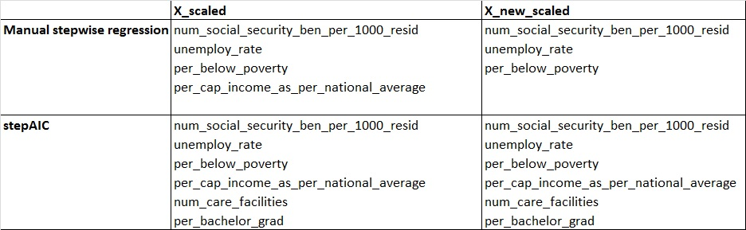
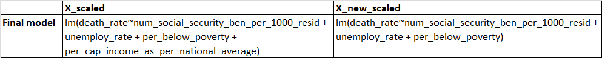

```{r "setup", include=FALSE}
knitr::opts_knit$set(root.dir = "C:\\Users\\LYC\\Desktop\\SFU\\Fall 2020 Courses\\STAT 350\\Final project\\data")
```

```{r include=FALSE}
# Initialization & import raw data

library(MASS)
library(ModelMetrics)

b1_population = read.csv("cc00_tab_B1_area_population.csv")
b4_vital_stat_health = read.csv("cc00_tab_B4_vital_statistics_and_health.csv")
b5_education_income_poverty = read.csv("cc00_tab_B5_education_income_poverty.csv")
b6_crime_housing = read.csv("cc00_tab_B6_crime_housing_building_permit.csv")
b7_labor_employment = read.csv("cc00_tab_B7_labor_force_employment.csv")
b8_income = read.csv("cc00_tab_B8_personal_income_earnings.csv")
b13_govt_programs = read.csv("cc00_tab_B13_govt_programs_employment_finances.csv")
```

```{r include=FALSE}
# Data preprocessing

death_rate = b4_vital_stat_health$B4.vst05
FIPS = b1_population$B1.geo01
county_name = b1_population$B1.geo09
population = b1_population$B1.pop03

num_care_facilities = b4_vital_stat_health$B4.hlt06
per_below_poverty = b5_education_income_poverty$B5.pov04
per_high_grad = as.numeric(b5_education_income_poverty$B5.edc06) - as.numeric(b5_education_income_poverty$B5.edc08)
per_bachelor_grad = b5_education_income_poverty$B5.edc08
num_violent_crimes = b6_crime_housing$B6.crm02
num_property_crimes = b6_crime_housing$B6.crm03
unemploy_rate = b7_labor_employment$B7.clf05
per_cap_income_as_per_national_average = b8_income$B8.pie06
num_social_security_ben_per_1000_resid = b13_govt_programs$B13.soc04

X = cbind(death_rate,FIPS,county_name,population,num_care_facilities,per_below_poverty,per_high_grad,per_bachelor_grad,num_violent_crimes,num_property_crimes,unemploy_rate,per_cap_income_as_per_national_average,num_social_security_ben_per_1000_resid)

X = as.data.frame(X)

states = toupper(c("Alabama","Alaska","Arizona","Arkansas","California","Colorado","Connecticut","Delaware","Florida","Georgia","Hawaii","Idaho","Illinois","Indiana","Iowa","Kansas","Kentucky","Louisiana","Maine","Maryland","Massachusetts","Michigan","Minnesota","Mississippi","Missouri","Montana","Nebraska","Nevada","New Hampshire","New Jersey","New Mexico","New York","North Carolina","North Dakota","Ohio","Oklahoma","Oregon","Pennsylvania","Rhode Island","South Carolina","South Dakota","Tennessee","Texas","Utah","Vermont","Virginia","Washington","West Virginia","Wisconsin","Wyoming"))

# delete US row
X = X[-1,]

#delete State rows
for (i in states){
  X = X[!grepl(i,X$county_name),]
}

# convert columns to numeric
i = c(1,4,5,6,7,8,9,10,11,12,13)

X[,i] = apply(X[,i], MARGIN = 2, function(x) as.numeric(as.character(x)))

# delete rows with NA values
X = X[-which(is.na(X), arr.ind = TRUE),]

# introduce our own datapoint (goal, introduce an influential point, see how that affects our model results and analysis)
interest = X[1,]
interest[,1] = 25 # death rate (really high, average is 10)
interest[,2] = 99999 # FIPS number
interest[,3] = 'crazytown' # county_name
interest[,4] = 100000 # population (avg)
interest[,5] = 12 # num_care_facilities (avg)
interest[,6] = 14.86 # per_below_poverty (avg)
interest[,7] = 56.14779 # per_high_grad (avg)
interest[,8] = 13.78 # per_bachelor_grad (avg)
interest[,9] = 501 # num_violent_crimes (avg)
interest[,10] = 3516 # num_property_crimes (avg)
interest[,11] = 4.73 # unemploy_rate (avg)
interest[,12] = 78 # per_cap_income_as_per_national_average (avg)
interest[,13] = 193 # num_social_security_ben_per_1000_resid (avg)

X_new = rbind(X,interest) # new dataframe with added observation

# feature scaling (standardize)
X_scaled = X
X_scaled[,i] = scale(X_scaled[,i])

X_new_scaled = X_new
X_new_scaled[,i] = scale(X_new_scaled[,i])

```

```{r include=FALSE}
# Feature selection using stepwise regression (our own implementation, alpha = 0.05)

which.max(abs(cor(X_scaled[-c(2,3,4)]))[-1,1])
# num_social_security_ben_per_1000_resid most correlative
summary(lm(data = X_scaled, death_rate ~ num_social_security_ben_per_1000_resid))

# residual given num_social_security_ben_per_1000_resid in the model
resid_step2 <- X_scaled[,1]-X_scaled[,13]*8.367e-01
# calculate the correlation, and find the most correlated
which.max(abs(cor(cbind(resid_step2, X_scaled[-c(1,2,3,4,13)])))[-1,1])
# per_below_poverty most correlative
summary(lm(data = X_scaled, death_rate ~ num_social_security_ben_per_1000_resid +
             per_below_poverty))

# residual given num_social_security_ben_per_1000_resid, and per_below_poverty in the model
resid_step3 <- X_scaled[,1] -
  X_scaled$num_social_security_ben_per_1000_resid*8.114e-01 -
  X_scaled$per_below_poverty*1.196e-01
# calculate the correlation, and find the most correlated
which.max(abs(cor(cbind(resid_step3,X_scaled[-c(1,2,3,4,6,13)])))[-1,1])
# unemploy_rate most correlative
summary(lm(data = X_scaled, death_rate ~ 
             num_social_security_ben_per_1000_resid +
             unemploy_rate + 
             per_below_poverty))

# residual given num_social_security_ben_per_1000_resid, per_below_poverty, and unemploy_rate in the model
resid_step4 <- X_scaled[,1] -
  X_scaled$num_social_security_ben_per_1000_resid*8.098e-01 -
  X_scaled$per_below_poverty * 1.745e-01 + 
  X_scaled$unemploy_rate * -9.933e-02
# calculate the correlation, and find the most correlated
which.max(abs(cor(cbind(resid_step4,X_scaled[-c(1,2,3,4,6,11,13)])))[-1,1])
# per_cap_income_as_per_national_average most correlative
summary(lm(data = X_scaled, death_rate ~ 
             num_social_security_ben_per_1000_resid +
             unemploy_rate + 
             per_below_poverty + 
             per_cap_income_as_per_national_average))

# residual given num_social_security_ben_per_1000_resid, per_below_poverty, unemploy_rate, and per_cap_income_as_per_national_average in the model
resid_step5 <- X_scaled[,1] -
  X_scaled$num_social_security_ben_per_1000_resid * 8.167e-01 -
  X_scaled$per_below_poverty * 1.933e-01 + 
  X_scaled$unemploy_rate * -9.521e-02 + 
  X_scaled$per_cap_income_as_per_national_average * 3.712e-02
# calculate the correlation, and find the most correlated
which.max(abs(cor(cbind(resid_step5,X_scaled[-c(1,2,3,4,6,12,11,13)])))[-1,1])
# num_care_facilities most correlative
summary(lm(data = X_scaled, death_rate ~ 
             num_social_security_ben_per_1000_resid +
             unemploy_rate + 
             per_below_poverty + 
             per_cap_income_as_per_national_average +
             num_care_facilities))

# do not include num_care_facilities since alpha = 0.156 > 0.05

final_model <- lm(data = X_scaled, death_rate ~ 
             num_social_security_ben_per_1000_resid +
             unemploy_rate + 
             per_below_poverty + 
             per_cap_income_as_per_national_average)
```

```{r include=FALSE}
# Feature selection using stepwise regression (MASS library function)

# Fit the full model 
full.model = lm(death_rate ~ num_care_facilities + per_below_poverty + 
                  per_high_grad + per_bachelor_grad + num_violent_crimes +
                  num_property_crimes + unemploy_rate + per_cap_income_as_per_national_average +
                  num_social_security_ben_per_1000_resid, data = X_scaled)
# Stepwise regression model
step.model = stepAIC(full.model, direction = "both", 
                      trace = FALSE)
```

```{r include=FALSE}
# Model validation

# Assumptions:
#   1. The relationship between the response y and the regressors is linear, at least approximately.
#   2. The error term ε has zero mean.
#   3. The error term ε has constant variance.
#   4. The errors are uncorrelated.
#   5. The errors are normally distributed.

final_model <- lm(data = X_scaled, death_rate ~ 
             num_social_security_ben_per_1000_resid +
             unemploy_rate + 
             per_below_poverty + 
             per_cap_income_as_per_national_average)

summary(final_model)

residuals = final_model$residuals

# student residual against y_hat and regressors
student_r = rstudent(final_model)

y_hat = predict(final_model,X_scaled)

par(mfrow=c(2,3))

plot(y_hat, student_r, main = "X_scaled: Student residuals vs Y_hat") # 3rd assumption & 1st assumption & 2nd assumption
abline(h = 0, col = "red")

plot(X_scaled[,13], student_r, main = "X_scaled: Student residuals vs num_social_security_ben_per_1000_resid") # 2nd/3rd
abline(h = 0, col = "red")

plot(X_scaled[,11], student_r, main = "X_scaled: Student residuals vs unemploy_rate") # 2nd/3rd
abline(h = 0, col = "red")

plot(X_scaled[,6], student_r, main = "X_scaled: Student residuals vs per_below_poverty") # 2nd/3rd
abline(h = 0, col = "red")

plot(X_scaled[,12], student_r, main = "X_scaled: Student residuals vs per_cap_income_as_per_national_avg") # 2nd/3rd
abline(h = 0, col = "red")

# other residual plots (QQ norm, residuals vs index)

qqnorm(student_r) # 5th assumption

plot(student_r, main = "X_scaled: Student residuals vs Index") # 4th assumption
abline(h=0, col = "red")

# find influential points, result: no data point's D > 1

mdl_cook = cooks.distance(final_model)

```

```{r include=FALSE}
# Cross validation

# model's original RMSE and MAE and coefficients
  rmse(y_hat, X_scaled[,1])
  mae(y_hat, X_scaled[,1])
  coef_social_security = final_model$coefficients[2]
  coef_unemploy_rate = final_model$coefficients[3]
  coef_per_below_poverty = final_model$coefficients[4]
  coef_per_cap_income_per_national_avg = final_model$coefficients[5]

# do experiment 1000 times. create a vector which will contain mean percentage error for each experiment. 
RMSPE = seq(1000)
MAPE = seq(1000)
coef_ss = seq(1000)
coef_unemploy = seq(1000)
coef_poverty = seq(1000)
coef_income = seq(1000)

index <- seq(1000)
for (index_i in index) {
  # Random select 80% data's index. 
  sample_index <- sample(length(X_scaled[,1]), round(2563*0.8, 0))
  # Store those data in X_scaled_80
  X_scaled_80 <- X_scaled[sample_index,]
  # Store remaining 20% test data in X_scaled_20
  X_scaled_20 <- X_scaled[-sample_index,]
  # apply model by using partial data
  final_model_80 <- lm(data = X_scaled_80, death_rate ~ 
             num_social_security_ben_per_1000_resid +
             unemploy_rate + 
             per_below_poverty + 
             per_cap_income_as_per_national_average)
  # calculate predict y
  predict_y_20 = predict(final_model_80, X_scaled_20)

  # store errors and coefficients
  RMSPE[index_i] = rmse(predict_y_20, X_scaled_20[,1])
  MAPE[index_i] = mae(predict_y_20, X_scaled_20[,1])
  coef_ss[index_i] = final_model_80$coefficients[2]
  coef_unemploy[index_i] = final_model_80$coefficients[3]
  coef_poverty[index_i] = final_model_80$coefficients[4]
  coef_income[index_i] = final_model_80$coefficients[5]
}
```

```{r include=FALSE}
# Stepwise regression (X_new_scaled)

# Fit full model and stepwise regression on X_new_scaled

full.model.new = lm(death_rate ~ num_care_facilities + per_below_poverty + 
                  per_high_grad + per_bachelor_grad + num_violent_crimes +
                  num_property_crimes + unemploy_rate + per_cap_income_as_per_national_average +
                  num_social_security_ben_per_1000_resid, data = X_new_scaled)

step.model.new = stepAIC(full.model.new, direction = "both", 
                      trace = FALSE)
```

```{r include=FALSE}
# Feature selection using stepwise regression (our own implementation, alpha = 0.05) (X_new_scaled)

which.max(abs(cor(X_new_scaled[-c(2,3,4)]))[-1,1])
# num_social_security_ben_per_1000_resid most correlative
summary(lm(data = X_new_scaled, death_rate ~ num_social_security_ben_per_1000_resid))

# residual given num_social_security_ben_per_1000_resid in the model
resid_step2 <- X_new_scaled[,1]-X_new_scaled[,13]*8.324e-01
# calculate the correlation, and find the most correlated
which.max(abs(cor(cbind(resid_step2, X_new_scaled[-c(1,2,3,4,13)])))[-1,1])
# per_below_poverty most correlative
summary(lm(data = X_new_scaled, death_rate ~ num_social_security_ben_per_1000_resid +
             per_below_poverty))

# residual given num_social_security_ben_per_1000_resid, and per_below_poverty in the model
resid_step3 <- X_new_scaled[,1] -
  X_new_scaled$num_social_security_ben_per_1000_resid*8.072e-01 -
  X_new_scaled$per_below_poverty*1.19e-01
# calculate the correlation, and find the most correlated
which.max(abs(cor(cbind(resid_step3,X_new_scaled[-c(1,2,3,4,6,13)])))[-1,1])
# unemploy_rate most correlative
summary(lm(data = X_new_scaled, death_rate ~ 
             num_social_security_ben_per_1000_resid +
             unemploy_rate + 
             per_below_poverty))

# residual given num_social_security_ben_per_1000_resid, per_below_poverty, and unemploy_rate in the model
resid_step4 <- X_new_scaled[,1] -
  X_new_scaled$num_social_security_ben_per_1000_resid*8.057e-01 -
  X_new_scaled$per_below_poverty * 1.736e-01 + 
  X_new_scaled$unemploy_rate * -9.882e-02
# calculate the correlation, and find the most correlated
which.max(abs(cor(cbind(resid_step4,X_new_scaled[-c(1,2,3,4,6,11,13)])))[-1,1])
# per_cap_income_as_per_national_average most correlative
summary(lm(data = X_new_scaled, death_rate ~ 
             num_social_security_ben_per_1000_resid +
             unemploy_rate + 
             per_below_poverty + 
             per_cap_income_as_per_national_average))

# residual given num_social_security_ben_per_1000_resid, per_below_poverty, unemploy_rate, and per_cap_income_as_per_national_average in the model
resid_step5 <- X_new_scaled[,1] -
  X_new_scaled$num_social_security_ben_per_1000_resid * 8.125e-01 -
  X_new_scaled$per_below_poverty * 1.923e-01 + 
  X_new_scaled$unemploy_rate * -9.474e-02 + 
  X_new_scaled$per_cap_income_as_per_national_average * 3.679e-02
# calculate the correlation, and find the most correlated
which.max(abs(cor(cbind(resid_step5,X_new_scaled[-c(1,2,3,4,6,12,11,13)])))[-1,1])
# num_care_facilities most correlative
summary(lm(data = X_new_scaled, death_rate ~ 
             num_social_security_ben_per_1000_resid +
             unemploy_rate + 
             per_below_poverty + 
             per_cap_income_as_per_national_average +
             num_care_facilities))

# do not include num_care_facilities since alpha = 0.1619 > 0.05
# remove per_cap_income_as_per_national_average since alpha = 0.0507 > 0.05
final_model_new <- lm(data = X_new_scaled, death_rate ~ 
             num_social_security_ben_per_1000_resid +
             unemploy_rate + 
             per_below_poverty)
```

```{r include=FALSE}
# final model (X_new_scaled)

final_model_new <- lm(data = X_new_scaled, death_rate ~ 
             num_social_security_ben_per_1000_resid +
             unemploy_rate + 
             per_below_poverty)
```

```{r include=FALSE}
# Model validation (X_new_scaled)

summary(final_model_new)

residuals = final_model_new$residuals

# student residual against y_hat and regressors
student_r_new = rstudent(final_model_new)

y_hat_new = predict(final_model_new,X_new_scaled)

par(mfrow=c(2,3))

plot(y_hat_new, student_r_new, main = "Student residuals vs Y_hat") # 3rd assumption & 1st assumption & 2nd assumption
abline(h = 0, col = "red")

plot(X_new_scaled[,13], student_r_new, main = "Student residuals vs num_social_security_ben_per_1000_resid") # good
abline(h = 0, col = "red")

plot(X_new_scaled[,11], student_r_new, main = "Student residuals vs unemploy_rate") # good
abline(h = 0, col = "red")

plot(X_new_scaled[,6], student_r_new, main = "Student residuals vs per_below_poverty") # good
abline(h = 0, col = "red")

plot(X_new_scaled[,12], student_r_new, main = "Student residuals vs per_cap_income_as_per_national_avg") # good
abline(h = 0, col = "red")

# other residual plots (QQ norm, residuals vs index)
qqnorm(student_r_new) # 5th assumption

#stripchart(X_new_scaled[2654,], vertical = T, method = "jitter", add=T, pch=20, col = "red" )

plot(student_r_new, main = "Student residuals vs Index") # 4th assumption
abline(h=0, col = "red")

# find influential points, result: no data point's D > 1

mdl_cook_new = cooks.distance(final_model_new)
```

Abstract

Our main purpose is to conduct a thorough regression analysis to analyze if there exist a linear relationship between U.S. death rate and a variety of independent variables.

A special observation (crazytown) is also added to see if it will have any impact on feature selection and if we can detect it during model validation.

At the end of all our analysis, we conclude that:

- Crazytown is identifiable during model validity analysis
- Crazytown does impact feature selection, but only for manual stepwise regression
- Our final linear regression model satisfies all assumption requirements
- Within our variables, the most explanatory for U.S. death rate are unemployment rate, poverty level, per capital income, and number of social security beneficiaries per 1000 residents

Introduction

Death has many contributing factors. In this report, we attempt to analyze U.S. death rate through linear regression analysis using U.S. 2000 census data. We also introduce a special observation (Crazytown) into the dataset for special analysis purpose.

Throughout this report, we are trying to answer the following five questions:
 
 - is there a linear relationship between the death rate and some of the independent variables? If so, which variables provide the most explanatory power?
 - does our linear regression model satisfy all model assumptions?
 - is Crazytown identifiable during model validation?
 - does Crazydown affect feature selection?

The core structure of our analysis is listed below:

1) download and preprocess data, create separate copy and include crazytown
2) feature selection (manual stepwise regression & stepAIC function) for original dataset and new dataset
3) model validation for both models (original and new dataset)
4) cross validation

<font size="25"> Data Description </font> 

All our data originates from the U.S. 2000 census. Since the entire census dataset contains too much information, we hand picked 10 variables to regress against the death rate. The detailed description of each variable is presented below:



The additional data point we introduce is called "Crazytown". There are two goals for introducing it.

1) Can our model validation process identify Crazytown?
2) Does Crazytown affect our feature selection process?

All values of Crazytown are column averages except for death_rate. where the county average is about 10, and we chose Crazytown's death_rate to be 25.

All values for Crazytown are shown below:
```{r}
X_means = colMeans(X[i])
crazytown = X_new[2654,][i]

crazytown2 = rbind(X_means,crazytown)
rownames(crazytown2) = c('County average','Crazytown')

crazytown2
```

<font size="25"> Analysis & Results </font>

Data Preprocessing

1) We extract all our variables from appropriate U.S. 2000 cencus data tables into a dataframe (original dataset)
2) Create another copy of the dataframe and incldue Crazytown (new dataset)
3) Unit normal scaling for all appropriate variables 

```{r}
death_rate = b4_vital_stat_health$B4.vst05
FIPS = b1_population$B1.geo01
county_name = b1_population$B1.geo09
population = b1_population$B1.pop03

num_care_facilities = b4_vital_stat_health$B4.hlt06
per_below_poverty = b5_education_income_poverty$B5.pov04
per_high_grad = as.numeric(b5_education_income_poverty$B5.edc06) - as.numeric(b5_education_income_poverty$B5.edc08)
per_bachelor_grad = b5_education_income_poverty$B5.edc08
num_violent_crimes = b6_crime_housing$B6.crm02
num_property_crimes = b6_crime_housing$B6.crm03
unemploy_rate = b7_labor_employment$B7.clf05
per_cap_income_as_per_national_average = b8_income$B8.pie06
num_social_security_ben_per_1000_resid = b13_govt_programs$B13.soc04

X = cbind(death_rate,FIPS,county_name,population,num_care_facilities,per_below_poverty,per_high_grad,per_bachelor_grad,num_violent_crimes,num_property_crimes,unemploy_rate,per_cap_income_as_per_national_average,num_social_security_ben_per_1000_resid)

X = as.data.frame(X)

states = toupper(c("Alabama","Alaska","Arizona","Arkansas","California","Colorado","Connecticut","Delaware","Florida","Georgia","Hawaii","Idaho","Illinois","Indiana","Iowa","Kansas","Kentucky","Louisiana","Maine","Maryland","Massachusetts","Michigan","Minnesota","Mississippi","Missouri","Montana","Nebraska","Nevada","New Hampshire","New Jersey","New Mexico","New York","North Carolina","North Dakota","Ohio","Oklahoma","Oregon","Pennsylvania","Rhode Island","South Carolina","South Dakota","Tennessee","Texas","Utah","Vermont","Virginia","Washington","West Virginia","Wisconsin","Wyoming"))

# delete US row
X = X[-1,]

#delete State rows
for (i in states){
  X = X[!grepl(i,X$county_name),]
}

# convert columns to numeric
i = c(1,4,5,6,7,8,9,10,11,12,13)

X[,i] = apply(X[,i], MARGIN = 2, function(x) as.numeric(as.character(x)))

# delete rows with NA values
X = X[-which(is.na(X), arr.ind = TRUE),]

# introduce our own datapoint (goal, introduce an influential point, see how that affects our model results and analysis)
interest = X[1,]
interest[,1] = 25 # death rate (really high, average is 10)
interest[,2] = 99999 # FIPS number
interest[,3] = 'crazytown' # county_name
interest[,4] = 100000 # population (avg)
interest[,5] = 12 # num_care_facilities (avg)
interest[,6] = 14.86 # per_below_poverty (avg)
interest[,7] = 56.14779 # per_high_grad (avg)
interest[,8] = 13.78 # per_bachelor_grad (avg)
interest[,9] = 501 # num_violent_crimes (avg)
interest[,10] = 3516 # num_property_crimes (avg)
interest[,11] = 4.73 # unemploy_rate (avg)
interest[,12] = 78 # per_cap_income_as_per_national_average (avg)
interest[,13] = 193 # num_social_security_ben_per_1000_resid (avg)

X_new = rbind(X,interest) # new dataframe with added observation

# feature scaling (standardize)
X_scaled = X
X_scaled[,i] = scale(X_scaled[,i])

X_new_scaled = X_new
X_new_scaled[,i] = scale(X_new_scaled[,i])
```

The resulting output from data preprocessing are two dataframes called "X_scaled" and "X_new_scaled". The only difference between the two is that X_new_scaled contains Crazytown.

Feature Selection

We performed manual stepwise regression and stepAIC on both X_scaled and X_new_scaled. For our manual stepwise regression process, we set alpha = 0.05. The resulting models for each is presented below:


Interestingly, when we used stepAIC for both datasets, we get the same model, but when we implement stepwise regression, the model under X_new_scaled does not contain the "per_cap_income_as_per_national_average" variable since it does not meet the alpha = 0.05 threshold. 

We chose to use variables from the manual stepwise regressions in our final models for further analysis.


Model validation

At this stage, we are trying to assess if our model under X_scaled data satisfy the following assumptions:

1. The relationship between the response y and the regressors is linear, at least approximately
2. The error term ε has zero mean
3. The error term ε has constant variance
4. The errors are uncorrelated
5. The errors are normally distributed

To assess the first three assumptions, we plotted student residuals against y_hat and also against all regressors in the model.
```{r}
plot(y_hat, student_r, main = "X_scaled: Student residuals vs Y_hat")
abline(h = 0, col = "red")
```
Looking at the student residuals vs Y_hat graph, we can see the error terms are spread quite evenly around zero. Although there are some errors outside three standard deviations, we have to keep in mind that there are over 2650 observations in total, and the general shape of the graph indicate the model satisfies the first, second, and third assumption. 

We graph residual errors against each regressor below to further analyze the second and third assumptions.
```{r}
par(mfrow=c(2,2))

plot(X_scaled[,13], student_r, main = "X_scaled: Student residuals vs\n num_social_security_ben_per_1000_resid")
abline(h = 0, col = "red")

plot(X_scaled[,11], student_r, main = "X_scaled: Student residuals vs\n unemploy_rate")
abline(h = 0, col = "red")

plot(X_scaled[,6], student_r, main = "X_scaled: Student residuals vs\n per_below_poverty") 
abline(h = 0, col = "red")

plot(X_scaled[,12], student_r, main = "X_scaled: Student residuals vs\n per_cap_income_as_per_national_avg")
abline(h = 0, col = "red")
```
Looking at these four graphs, they match our initial assessment that our model satisfies the second and third assumption. In each graph we can observe errors are spread quite evenly around zero. Once again, there are a few points that are outside three standard deviations, we think this is acceptable due to the large number of observations we have in our dataset. 

Next, we plot the QQ norm plot below:
```{r}
qqnorm(student_r, main = "X_scaled: Normal QQ Plot")
```
We observe that it is not perfectly diagonal, but relatively close. We conclude that it is satisfactory to meet the 5th assumption. 

Next, we plot student residuals aginast index below:
```{r}
plot(student_r, main = "X_scaled: Student residuals vs Index")
abline(h=0, col = "red")
```
Similar to other plots above, we observe the vast majority of errors are spread evenly in a tight band around zero. A few error terms do lie outside three standard deviations. From this graph, we conclude that this model also meets the fourth assumption.

Lastly, we calculated Cook's distance for each datapoint. If any datapoint has a value larger than 1, we deem it influential. We find that the largest Cook's distance value is only 0.04.
```{r}
mdl_cook = cooks.distance(final_model)

max(mdl_cook)
```
At this point, we can conclude that the linear regression model using X_scaled data meets all five model assumptions.

Can we identify Crazytown during model validation analysis?

To answer this question, we conduct model validation analysis for the model under X_new_scaled dataset since it includes Crazytown.

Again, we plot student residuals against Y_hat, and against each regressor in the model. These graphs are presented below:
```{r}
residuals = final_model_new$residuals

y_hat_new = predict(final_model_new,X_new_scaled)

layout(matrix(c(1,1,2,2,3,3,4,4), nrow = 2, ncol = 4, byrow = TRUE))

plot(y_hat_new, student_r_new, main = "X_new_scaled: Student residuals vs Y_hat")
abline(h = 0, col = "red")
text(0,9,"Crazytown", col = "red")

plot(X_new_scaled[,13], student_r_new, main = "X_new_scaled: Student residuals vs\n num_social_security_ben_per_1000_resid")
abline(h = 0, col = "red")
text(0,9,"Crazytown", col = "red")

plot(X_new_scaled[,11], student_r_new, main = "X_new_scaled: Student residuals vs\n unemploy_rate")
abline(h = 0, col = "red")
text(0,9,"Crazytown", col = "red")

plot(X_new_scaled[,6], student_r_new, main = "X_new_scaled: Student residuals vs\n per_below_poverty")
abline(h = 0, col = "red")
text(0,9,"Crazytown", col = "red")
```
From each of these plots, we can clearly identify there is one error that is 10 standard deviations away. This point belongs to Crazytown. To make the comparison more clearly, we plot Student residuals vs Y_hat for both X_scaled and X_new_scaled data below, and we observe the only difference is the error term that belongs to Crazytown:

```{r}
layout(matrix(c(1,1,2,2), nrow = 1, ncol = 4, byrow = TRUE))

plot(y_hat, student_r, main = "X_scaled: Student residuals vs Y_hat")
abline(h = 0, col = "red")

plot(y_hat_new, student_r_new, main = "X_new_scaled: Student residuals vs Y_hat") 
abline(h = 0, col = "red")
text(0,9,"Crazytown", col = "red")
```
Lastly, we conduct cross validation analysis for two purposes:

1) Study the stability of model coefficients
2) Study the stability of prediction performance of the model

We split X_scaled dataset into 80% training and 20% validation sets. Then we run 1000 simulations and recorded each run's RMSPE, MAPE, and model coefficients.
```{r}
# model's original RMSE and MAE and coefficients
  rmse_x_scaled = rmse(y_hat, X_scaled[,1])
  mae_x_scaled = mae(y_hat, X_scaled[,1])
  coef_social_security = final_model$coefficients[2]
  coef_unemploy_rate = final_model$coefficients[3]
  coef_per_below_poverty = final_model$coefficients[4]
  coef_per_cap_income_per_national_avg = final_model$coefficients[5]

# do experiment 1000 times.
RMSPE = seq(1000)
MAPE = seq(1000)
coef_ss = seq(1000)
coef_unemploy = seq(1000)
coef_poverty = seq(1000)
coef_income = seq(1000)

index <- seq(1000)
for (index_i in index) {
  # Random select 80% data's index. 
  sample_index <- sample(length(X_scaled[,1]), round(2563*0.8, 0))
  # Store those data in X_scaled_80
  X_scaled_80 <- X_scaled[sample_index,]
  # Store remaining 20% test data in X_scaled_20
  X_scaled_20 <- X_scaled[-sample_index,]
  # apply model by using partial data
  final_model_80 <- lm(data = X_scaled_80, death_rate ~ 
             num_social_security_ben_per_1000_resid +
             unemploy_rate + 
             per_below_poverty + 
             per_cap_income_as_per_national_average)
  # calculate predict y
  predict_y_20 = predict(final_model_80, X_scaled_20)

  # store errors and coefficients
  RMSPE[index_i] = rmse(predict_y_20, X_scaled_20[,1])
  MAPE[index_i] = mae(predict_y_20, X_scaled_20[,1])
  coef_ss[index_i] = final_model_80$coefficients[2]
  coef_unemploy[index_i] = final_model_80$coefficients[3]
  coef_poverty[index_i] = final_model_80$coefficients[4]
  coef_income[index_i] = final_model_80$coefficients[5]
}
```

Next we plot the histogram for RMSPE, MAPE to visualize the variability of each.

```{r}
layout(matrix(c(1,1,2,2), nrow = 1, ncol = 4, byrow = TRUE))

hist(RMSPE)
points(x = rmse_x_scaled, y = 1, type = "p", col="red")
text(rmse_x_scaled,25,"RMSE from X_scale full dataset", col = "red")

hist(MAPE)
points(x = mae_x_scaled, y = 1, type = "p", col="red")
text(mae_x_scaled,25,"MAE from X_scale full dataset", col = "red")
```
From the above graphs, we can conclude that the variablity for both RMSPE and MAPE are quite small.

Next, we also plot the histogram for model coefficients, and observe that all four coefficients' variability are minimal.
```{r}
layout(matrix(c(1,1,2,2,3,3,4,4), nrow = 2, ncol = 4, byrow = TRUE))
  
hist(coef_ss)
points(x = coef_social_security, y = 1, type = "p", col="red")
text(coef_social_security,25,"coefficient from X_scale full dataset", col = "red")

hist(coef_unemploy)
points(x = coef_unemploy_rate, y = 5, type = "p", col="red")
text(coef_unemploy_rate,25,"coefficient from X_scale full dataset", col = "red")

hist(coef_poverty)
points(x = coef_per_below_poverty, y = 1, type = "p", col="red")
text(coef_per_below_poverty,25,"coefficient from X_scale full dataset", col = "red")

hist(coef_income)
points(x = coef_per_cap_income_per_national_avg, y = 1, type = "p", col="red")
text(coef_per_cap_income_per_national_avg,25,"coefficient from X_scale full dataset", col = "red")

```

Conclusion

At the beginning of our report, we identified five key questions to address:
  - is there a linear relationship between the death rate and some of the independent variables? If so, which variables provide the most explanatory power?
  - does our linear regression model satisfy all model assumptions?
  - is Crazytown identifiable during model validation?
  - does crazydown affect feature selection?
  
Though our analysis presented above, we conclude that:
  - There is a reasonable linear relationship between death rate and some of the independent variables; Unemploy_rate, per_below_poverty, per_cap_income_as_per_national_average, and num_social_security_ben_per_1000_resid provided the most explanatory power. R2 is 72%, so our model probably still miss some key variables that weren't included in our original set of independent variables.
  - Our linear regression model satisfies all five model assumptions
  - Crazytown was identified during model validation analysis
  - Crazytown did affect feature selection, but interestingly enough it only affected manual stepwise regression and not stepAIC 
  
What we learned:
  - Extreme outliers can affect feature selection.
  - If we do find outliers that we need to delete from our dataset, we should go back to feature selection to see if there is any change in features selected. 
  - Understanding what questions we are trying to answer is very important. It took us a while to figure out what exactly we are trying to analyze. 
  - Data preprocessing and organization is also very important. There are many components for this report and it was a lot easier to pull everything together when files and codes are organized logically. 

Appendix

